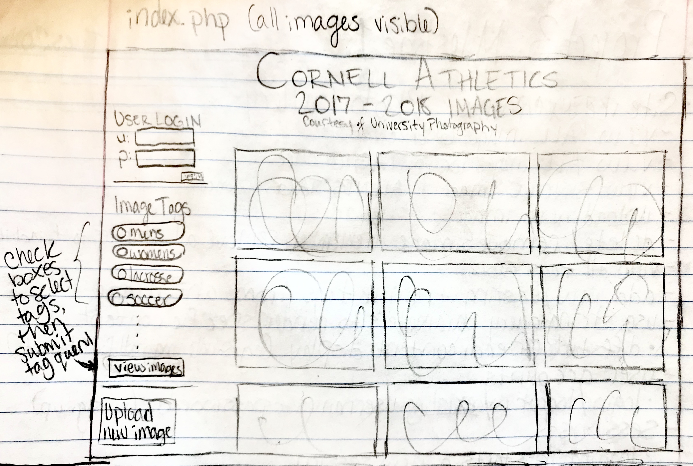
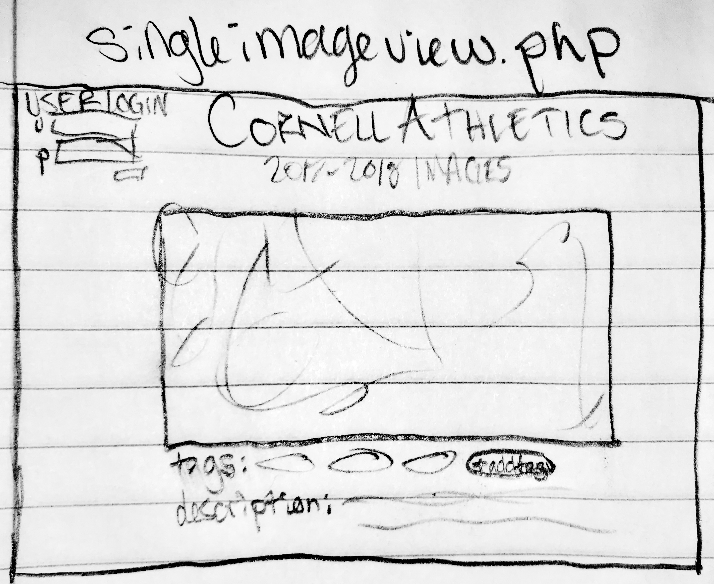
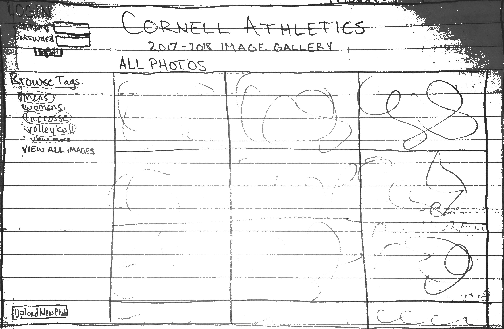
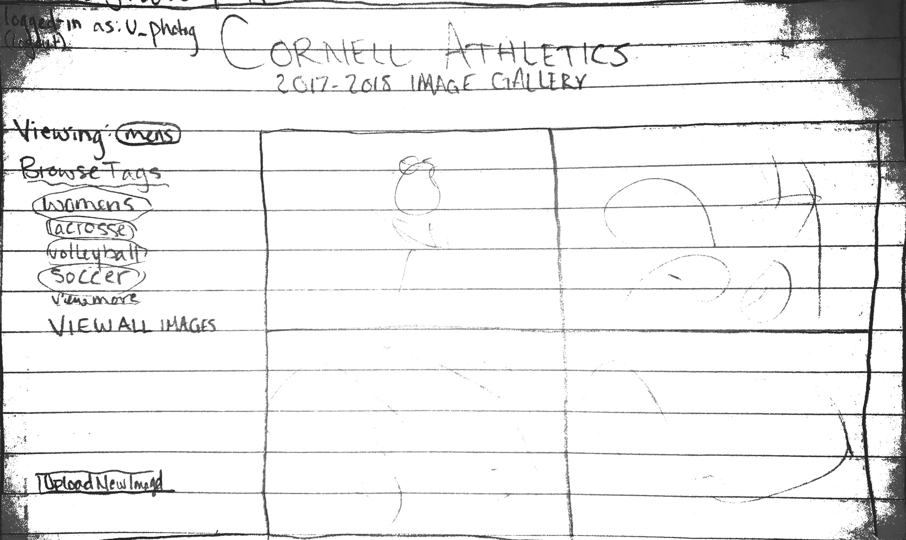

# Project 3 - Design & Plan

Your Name: **Grace Rieflin**

## 1. Persona

I've selected **Patricia** as my persona.

I've selected Patricia as my persona because she learns about how to use a platform by tinkering with things to see how they work, as opposed to having to first understand the process behind their functionalities. With the filter tags that will be involved in this website, Patricia would work well with trying out and seeing what different tags reveal, and would prompt me to accommodate this style by making the selection of tags by the user as salient as possible while they browse the site.

## 2. Sketches & Wireframes

### Sketches






### Wirefames






I think that my chosen design would be effective for Patricia because having the 'Browse Tags' options always present on each page will appeal to Patricia's desire to tinker/experiment with the site's functionalities easily. With this, she is always able to go back to broader categories of images as she browses the site, so she's able to easily bounce from view-to-view.

## 3. Database Schema Plan

[Describe the structure of your database. You may use words or a picture. A bulleted list is probably the simplest way to do this.]

**Table: `accounts`**
* `id`: unique auto-increment integer primary key not null
* `username`: unique text field, not null
* `password`: text field, not null
* `session_id`: unique text field

**Table: `images`**
* `id`: unique auto-increment integer primary key not null
* `filename`: unique text field, not null; includes file extension (ex. "IMG_5151.JPG").
* `img_alt`: (maybe) text field, not null; will be the alt value in the img html tag for the image (ex. "Cat").
* `description`: text field; will be the image description (ex. "A picture of my cat that I took last week.")
* `uploader`: foreign key of a `username` (or `id`, TBD) from the `accounts` table that points to the user that uploaded the file, and that will have special access to altering the file.

**Table: `tags`**
* `id`: unique auto-increment integer primary key not null
* `tag_name`: unique text field, not null; just a list of the existing tags.

**Table: `image_tag`**: Full Join table between images and tags. Each entry is a unique identifier of a file-tag pair.
* `id`: unique auto-increment integer primary key not null
* `photo_id`: foreign key pointing to `id` of an image in `images` table; integer not null
* `tag_id`: foreign key pointing to `id` of an image in `tags` table; integer not null

**Table: `view_tag`** (*Might* implement, if I think it'll help with my organization. If I do choose to implement, I'd do a similar one for `view_single` for singular image pages, since the project write-up recommended it.)
* `id`: unique auto-increment integer primary key not null
* `photo_id`: foreign key pointing to the id of a particular file/image in the images, selected from a query defining the tag_id to select from in the image_tag table.


## 4. Database Query Plan

* for `index.php`
  * to view all images: `"SELECT filename, img_alt FROM images;"`.
  * to view all tags: `"SELECT tag_name FROM tags;"` (probably also included on tagview.php).

* for `tagview.php` to view all images with a specific tag `tag_name`: `"SELECT id FROM tags WHERE tag_name= :tag_name"` (<- might be unnecessary extra query), then that `id` is used as `tag_id` for `"SELECT photo_id FROM image_tag WHERE tag_id= :tag_id;"`, which will be used to `"SELECT filename, img_alt FROM images WHERE id= :photo_id;"` to build the gallery of images with the selected tag.

* for `singleview.php`
  * to view a single image (with its details) when that image was clicked: `"SELECT * FROM images WHERE filename= :img_selected;"`
  * to view that image's tags, above `id` will be used as `img_id` for `"SELECT tag_id FROM image_tag WHERE photo_id= :img_id;"` which would be used for `"SELECT tag_name FROM tags WHERE id= :tag_id;"`.
  * to allow user logged-in as the image's `uploader` to view special access tools: if user= :uploader, show DELETE functionalities for image and tags. `"DELETE * FROM [images/tags/image_tag] WHERE [id/id/photo_id/tag_id]= :[id]";` to allow removal of all data related to that record.
  * using the `view_tag` table, consider `INSERT` for this page and `tagview.php` if `view_single` and `view_tag` tables are implemented.

## 5. Structure and Pseudocode

### Structure

[List the PHP files you will have. You will probably want to do this with a bulleted list.]

* index.php - main page; allows user to view ALL images at once.
* includes/init.php - stuff that useful for every web page.
* includes/header.php - header for every web page, has login form if applicable.
* includes/sidetags.php - displays tags on left side of applicable pages, possibly formatted dependent on active tags for that page.
* tagview.php - page that allows user to view all images that correspond to a selected tag at once.
* singleview.php - page that allows user to view a single image along with its tags, description, and any other details.
* uploadnew.php - page that contains a form for users to upload new images.

### Pseudocode

[For each PHP file, plan out your pseudocode. You probably want a subheading for each file.]

#### index.php

```
Pseudocode for index.php...

include init.php

function display_images_all
// called in body in foreach loop to display individual images

if valid session, define user-specific variables that will be used in some body functionalities

*start HTML*

include header.php

include sidetags.php

link to uploadnew.php (possibly only if logged-in, if we think this is a good idea??? (would otherwise be hidden? or just prompt them to log-in once they get to uploadnew.php? Please let me know what you think would be the better UX))

foreach images as image : display_images_all(image)

```

#### includes/init.php

```
messages = array to store messages for user (you may remove this) // I have not decided whether or not I will use this for communicating with the user.

// DB helper functions (you do not need to write this out since they are provided.)

db = connect to db

define session status

```

#### includes/header.php
```
h1 Cornell Athletics
h3 2017-2018 Images

if logged-in: display "logged-in as" message.
else: display login form.

```

#### includes/sidetags.php
```
if tag_selected and on tagview.php:
  special display for active tag
  display non-active tags differently
else:
  display all tag options as selectable list/form with submit button that will set tag_selected and redirect to a tagview.php
(maybe another formatting option for tags that apply to the single photo for singleview.php)

include a 'view all' link to return to index.php to view all images

```


#### tagview.php

```
include init.php

function display_images_tag
// called in body in foreach loop to display individual images, formatted differently from index.php

use selected_tag for SQL query to select 'photo_id's from image_tag table

$images = exec_sql_query(...)

*Start HTML body*

include header.php

include sidetags.php (with applicable formatting options)

foreach image_tag as image:
  display_images_tag(image)
  // selecting only the images from the relevant SQL query for this tag

```

#### singleview.php

```
include init.php

SQL query as "SELECT * FROM images WHERE filename= :file_id;"

$image = exec_sql_query(...)

*Start HTML body*

include header.php

include sidetags.php (with applicable formatting options)

single html code for relevant variable for the individual image
  filename as img tag
  <query for all tag_id that apply to this photo_id in image_tag and display those tags>
  <if username for this session matches this image's uploader, display delete/remove options>
  description

```

#### uploadnew.php

```
include init.php

ensure active logged-in session

*Start HTML body*

include header.php

include sidetags.php (with applicable formatting options)

Form (for entry into images):
  button to select file from user's computer (-> filename)
  Image Title text field (-> img_alt)
  Image Description text area (maybe optional) (-> description)
  Image Tags: dropdown list of existing tag_selected
    possibly an additional field that looks like the 'add new tag' icon on the singleview.php page that allows for new tag entries
  Button (submit action): Upload Entry

-> new INSERT SQL query for images table with defined fields upon submission; else push error message

```


## 6. Seed Data - Username & Passwords

[username : password]

* master : main1
* u_photog : cornellian // uploader of all originally-included photos
